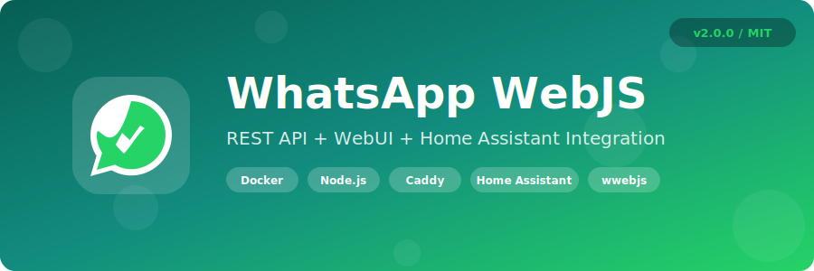
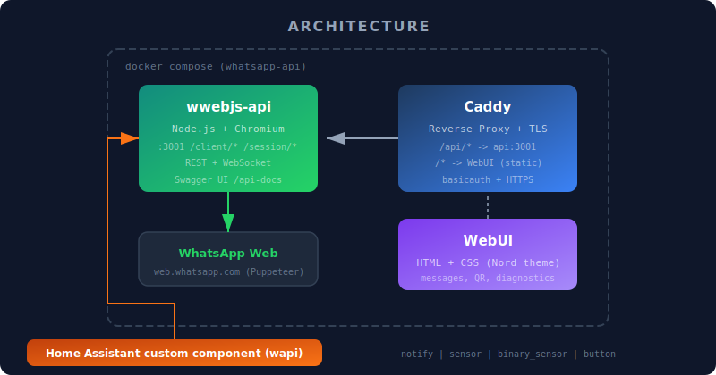

<p align="center">
  
</p>

<p align="center">
  <a href="#features">Features</a> &bull;
  <a href="#quick-start">Quick Start</a> &bull;
  <a href="#api-reference">API</a> &bull;
  <a href="#webui">WebUI</a> &bull;
  <a href="#home-assistant">Home Assistant</a> &bull;
  <a href="#license">License</a>
</p>

<p align="center">
  
  
  
  
  
</p>

---

Self-hosted WhatsApp messaging stack: a **REST API** powered by [whatsapp-web.js](https://github.com/pedroslopez/whatsapp-web.js), a **web dashboard** for sending messages and diagnostics, and a **Home Assistant custom integration** for notifications — all wrapped in Docker Compose with Caddy as a TLS reverse proxy.

## Architecture

<p align="center">
  
</p>

| Component | Description |
|---|---|
| **api/** | Node.js REST API wrapping whatsapp-web.js (Chromium via Puppeteer) |
| **webui/** | Single-page dashboard — send messages, view QR codes, session diagnostics |
| **ha-integration/** | Home Assistant custom component (`wapi`) — notify, sensors, buttons |
| **Caddyfile** | Reverse proxy with TLS termination and optional basicauth |

## Features

- **Multi-session** — run multiple WhatsApp Web sessions simultaneously
- **REST API** with Swagger docs (`/api-docs`) — send text, media, locations
- **WebSocket** support for real-time session events
- **WebUI** — Nord-themed dashboard with message panel, QR scanner, diagnostics, and live logs
- **Home Assistant integration** — `notify` entity per contact, session state sensor, connectivity binary sensor, test buttons
- **Docker Compose** — single `docker compose up -d` with health checks, resource limits, and graceful shutdown
- **TLS** via Caddy with wildcard certificates
- **Rate limiting** — configurable per-window request limits
- **Session persistence** — sessions survive container restarts

## Quick Start

### Prerequisites

- Docker + Docker Compose v2
- TLS certificates (or let Caddy handle ACME)

### 1. Clone and configure

```bash
git clone https://github.com/jrx-code/whatsapp-webjs.git
cd whatsapp-webjs
cp .env.example .env
```

Edit `.env` with your values:

```env
# WhatsApp API
API_KEY=your-secret-api-key
PORT=3001
RECOVER_SESSIONS=true
AUTO_START_SESSIONS=true
HEADLESS=true
LOG_LEVEL=info
RATE_LIMIT_MAX=1000
RATE_LIMIT_WINDOW_MS=1000

# Caddy / TLS
DOMAIN=whatsapp.example.com
SSL_CERT_DIR=/path/to/ssl/certs

# Network (for macvlan setups — omit if using host/bridge)
CADDY_MAC=02:42:00:00:00:00
EXT_NETWORK=your-external-network
```

### 2. Start

```bash
docker compose up -d
```

### 3. Scan QR

Open `https://your-domain/` in a browser, click **Show QR**, and scan with WhatsApp on your phone.

### 4. Send a message

```bash
curl -X POST https://your-domain/api/client/sendMessage/SESSION_ID \
  -H "Content-Type: application/json" \
  -H "x-api-key: your-secret-api-key" \
  -d '{"chatId":"123456789@c.us","contentType":"string","content":"Hello!"}'
```

## API Reference

Base URL: `https://your-domain/api/`

| Method | Endpoint | Description |
|---|---|---|
| `GET` | `/ping` | Health check |
| `GET` | `/session/start/:id` | Start a session |
| `GET` | `/session/status/:id` | Session status |
| `GET` | `/session/qr/:id` | Get QR code |
| `GET` | `/session/qr/:id/image` | QR as PNG image |
| `POST` | `/client/sendMessage/:id` | Send a message |
| `GET` | `/client/getChats/:id` | List chats |
| `GET` | `/client/getContacts/:id` | List contacts |
| `DELETE` | `/session/terminate/:id` | Stop session |

Full Swagger documentation available at `/api-docs` when the API is running.

### Message payload

```json
{
  "chatId": "123456789@c.us",
  "contentType": "string",
  "content": "Hello, World!"
}
```

- Individual chats: `<phone>@c.us` (e.g., `48500600700@c.us`)
- Group chats: `<group-id>@g.us`

### Media messages

```json
{
  "chatId": "123456789@c.us",
  "contentType": "MessageMedia",
  "content": {
    "mimetype": "image/jpeg",
    "data": "<base64>",
    "filename": "photo.jpg"
  }
}
```

## WebUI

The web dashboard is served by Caddy at the root URL. Features:

- **Message panel** — send text messages to any contact or group
- **Session selector** — switch between multiple WhatsApp sessions
- **QR code display** — scan to authenticate new sessions
- **Diagnostics** — session state, phone number, platform, WhatsApp Web version
- **Live logs** — toggle the sidebar to view real-time API events
- **Nord theme** — clean dark UI with forest background

## Home Assistant

### Installation

Copy the `ha-integration/` folder to your Home Assistant custom components:

```bash
cp -r ha-integration/ /config/custom_components/wapi/
```

Restart Home Assistant, then add the integration via **Settings > Devices & Services > Add Integration > WhatsApp Notifier**.

### Configuration

The config flow will ask for:

1. **API URL** — e.g., `http://wwebjs-web-api:3001` (Docker internal) or `https://your-domain`
2. **API Key** — same as `API_KEY` in `.env`
3. **Session ID** — the WhatsApp session to use
4. **Contacts** — name/chatId pairs for notify entities and test buttons

### Entities

| Platform | Entity | Description |
|---|---|---|
| `notify` | `notify.whatsapp_<contact>` | Send message to a configured contact |
| `sensor` | `sensor.whatsapp_session_state` | Current session state (CONNECTED, QR, etc.) |
| `binary_sensor` | `binary_sensor.whatsapp_connected` | Session connectivity |
| `button` | `button.whatsapp_test_<contact>` | Send test message to a contact |

### Automation example

```yaml
automation:
  - alias: "Alert on motion"
    trigger:
      - platform: state
        entity_id: binary_sensor.front_door_motion
        to: "on"
    action:
      - action: notify.send_message
        data:
          entity_id: notify.whatsapp_jarek
          message: "Motion detected at the front door!"
```

## Project Structure

```
whatsapp-webjs/
├── api/                    # Node.js REST API
│   ├── Dockerfile          # Multi-stage build (Node 22 + Chromium)
│   ├── server.js           # Express server entry point
│   ├── src/
│   │   ├── app.js          # Express app setup
│   │   ├── config.js       # Environment config
│   │   ├── controllers/    # Route handlers
│   │   ├── routes.js       # API routes
│   │   ├── sessions.js     # Session management
│   │   ├── websocket.js    # WebSocket handler
│   │   └── middleware.js   # Auth & rate limiting
│   ├── swagger.json        # OpenAPI 3.0 spec
│   └── package.json
├── ha-integration/         # Home Assistant custom component
│   ├── __init__.py         # Integration setup
│   ├── api.py              # wwebjs-api client
│   ├── config_flow.py      # UI config flow
│   ├── notify.py           # NotifyEntity per contact
│   ├── sensor.py           # Session state sensor
│   ├── binary_sensor.py    # Connectivity sensor
│   ├── button.py           # Test message buttons
│   ├── manifest.json
│   └── services.yaml
├── webui/                  # Static web dashboard
│   ├── index.html          # SPA with vanilla JS
│   ├── nord.css            # Nord color theme
│   └── whatsapp.css        # Custom styles
├── Caddyfile               # Reverse proxy config
├── docker-compose.yaml     # Full stack definition
├── .env.example            # Environment template
└── .gitlab-ci.yml          # CI/CD pipeline
```

## Docker Compose Services

| Service | Image | Resources | Health Check |
|---|---|---|---|
| `api` | `wwebjs-api-patched:latest` (built from `api/Dockerfile`) | 1 GB RAM, 0.5 CPU | `GET /ping` every 30s |
| `caddy` | `caddy:2-alpine` | 64 MB RAM, 0.25 CPU | `caddy version` every 30s |

## Contributing

1. Fork the repository
2. Create a feature branch (`git checkout -b feat/amazing-feature`)
3. Commit your changes (`git commit -m 'feat: add amazing feature'`)
4. Push to the branch (`git push origin feat/amazing-feature`)
5. Open a Pull Request

## Credits

- [whatsapp-web.js](https://github.com/pedroslopez/whatsapp-web.js) — WhatsApp Web client library
- [wwebjs-api](https://github.com/avoylenko/wwebjs-api) by Anton Voylenko — original REST API wrapper (forked and extended)
- [Caddy](https://caddyserver.com/) — automatic HTTPS reverse proxy

## License

This project is licensed under the MIT License. See the [LICENSE](api/LICENSE) file for details.

---

<p align="center">
  Made with  and  by <a href="https://github.com/jrx-code">JrX</a>
</p>
